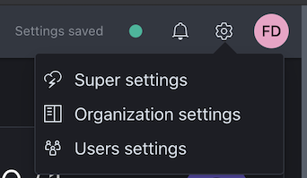
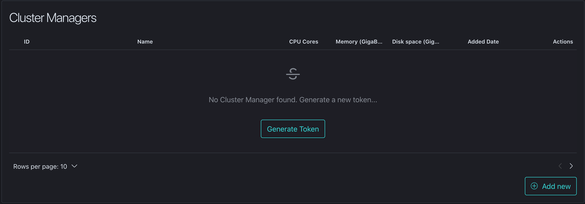
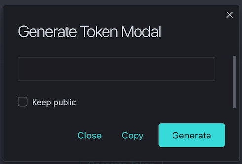
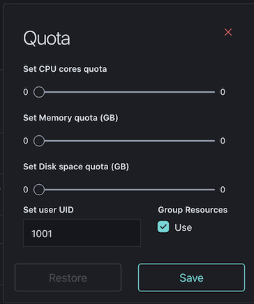

# ClusterManager

This repo contains the ILLUMINA clustermanager software. 

## Basic concepts
The CM connects your hardware to the ILLUMINA platform so that it can be used as a computing node. At this stage only a single server management is provided, while we are developing a version that will be able to manage a kubernetes or a docker swarm cluster.
To add multiple nodes (i.e. CMs), you will need to provide a common storage among them. This can be easily done via a NFS server
* [RedHat/Centos](https://access.redhat.com/documentation/en-us/red_hat_enterprise_linux/7/html/storage_administration_guide/nfs-serverconfig)
* [Ubuntu](https://help.ubuntu.com/community/NFSv4Howto)
* [Debian](https://wiki.debian.org/NFSServerSetup)

a Gluster server
* [Gluster installation](https://docs.gluster.org/en/latest/)

or an object storage solution via s3fs
* [s3fs docs](https://github.com/s3fs-fuse/s3fs-fuse)

## Installing the software
The software comes in different flavors. An rpm is provided for the Centos/RedHat community, a deb package for the Ubuntu/Debian and three executables (x86_64, Mach-O for x86_64 and arm)

### RPM installation
To install via the RPM package, simply run (as root):
```bash
yum -y install clustermanager-<version>.rpm
```

### DEB installation
To install via del DEB package, simply run (as root):
```bash
dpkg -i clustermanager-<version>.deb
```

### Manual installation
The deb and rpm packages will take care of installing the requirements. In case you're using the binary directly, make sure to install the following:
* docker
* redis

A quick way to have redis is to use it as a docker container
```bash
docker run -it -d -p 6379:6379 redis:latest
```
Please have a look at the [redis docker documentation](https://hub.docker.com/_/redis) for further information.

Copy the binary and use the **_-config_** to provide the path to look for the configuration file. The configuration file has to be name according to the ENVIRONMENT variable. If it is not set, use the following command:

```bash
export ENVIRONMENT=production
```

then launch the CM (as root) with the following command:

```bash
./clustermanager -config /etc/clustermanager
```

and the CM will look for the **_/etc/clustermanager/production.yml_** configuration file.
In the next section we'll have a deeper look at the configuration file.

## Configuring your clustermanager
The following text describes a CM configuration file:
```yaml
workflow:
    host_configuration:
        hostname: "wfm.illumina.laserromae.it"
        port: "8080"
    connection_configuration:
        use_tls: true
portal:
    host_configuration:
        hostname: "backend.illumina.laserromae.it"
        port: "7070"
    connection_configuration:
        use_tls: true
qmanager:
    connection_configuration:
        use_tls: true
database:
    host_configuration:
        hostname: "localhost"
        port: "6379"
    credentials_configuration:
        username: ""
        password: ""
    connection_configuration:
        use_tls: false
ca_cert_file: "/usr/local/clustermanager/certs/fullchain.pem"
base_path: "/data/"
tmp_path: "/data/tmp/"
hostname: ""
storage_prefix: "illumina-"
```
As most of the params are pretty self-explainatory, please make sure you pay attention to the following:
* the **ca_cert_file**, which points to the [Let's Encrypt R1](https://letsencrypt.org/certificates/) root certificate (or full chain) in pem format (this is needed as not all the Linux distributions store it by default)
* the **base_path**, which represents the path from which the CM will deploy its contents and files.
* the **tmp_path** is currently not used in this version (but will be needed for the object storage sync)
* the **hostname** param, which is used to override the hostname that is sent to the WorkflowManager.
* the **storage_prefix** param, which is used to prefix the folders created under the base_path.

## Adding a clustermanager to the Organization page
First action you need to take is to login to your ILLUMINA account and go to settings (this is limited to the organization admins only)



Find the clustermanager section in the administration panel


then you need to generate a token for your new cluster manager by either clicking on __Generate Token__ or __Add new__



press the __Generate__ token and then __Copy__ it in your clipboard.

## Starting your clustermanager
Once all the preparation work as been done, we can proceed with the CM startup. Launch the following command in order to configure the startup token (the following instruction will refer to the package installed version, for manually installed one don't forget to use the -config pointing at the right configuration folder):

```bash
./clustermanager -auth-token "<token created in the page>"
```
you should have the following output:
```bash
2021/04/16 14:11:08 [BOOTSTRAP]: Config path found: /usr/local/clustermanager/etc/
2021/04/16 14:11:08 [BOOTSTRAP]: Retrieving configuration...
2021/04/16 14:11:08 [BOOTSTRAP]: Config retrieved successfully!
2021/04/16 14:11:08 [BOOTSTRAP]: Opening database connection...
2021/04/16 14:11:08 [BOOTSTRAP]: Database connection opened successfully!
[ILLUMINA]: token successfully stored on db, exiting.
```

now you can start the clustermanager service with
```bash
systemctl start clustermanager
```
in your system log file (typically /var/log/message) you should see the following output:

```bash
2021/04/16 14:22:19 [BOOTSTRAP]: Config path found: /usr/local/clustermanager/etc/
2021/04/16 14:22:19 [BOOTSTRAP]: Retrieving configuration...
2021/04/16 14:22:19 [BOOTSTRAP]: Config retrieved successfully!
2021/04/16 14:22:19 [BOOTSTRAP]: Opening database connection...
2021/04/16 14:22:19 [BOOTSTRAP]: Database connection opened successfully!
2021/04/16 14:22:19 [BOOTSTRAP]: Opening docker connection...
2021/04/16 14:22:19 [BOOTSTRAP]: Docker connection opened successfully!
2021/04/16 14:22:19 [BOOTSTRAP]: Initializing the GRPC_Clients...
2021/04/16 14:22:19 [BOOTSTRAP]: WFM GRPC_Client initialized successfully!
2021/04/16 14:22:19 [BOOTSTRAP]: Subscribing the cluster to RabbitMQ...
2021/04/16 14:22:19 [BOOTSTRAP]: Completed!
2021/04/16 14:22:19 [sending...]
2021/04/16 14:22:19 [AUTH]: updating cluster id as [60799ad930c4e1392ce1d06d]
2021/04/16 14:22:20 [QMANAGER_BOOT]: subscribing to [readySandbox] queue...
2021/04/16 14:22:20 [QMANAGER_BOOT]: subscribing to [logStreaming] queue...
2021/04/16 14:22:20 [QMANAGER_BOOT]: subscribing to [downloadSandboxLog] queue...
2021/04/16 14:22:20 [QMANAGER_BOOT]: subscribing to [actions] queue...
2021/04/16 14:22:20 [QMANAGER]: Successfully subscribed to downloadSandboxLog channel!
2021/04/16 14:22:20 [QMANAGER]: Successfully subscribed to [actions] channel!
2021/04/16 14:22:20 [QMANAGER]: Successfully subscribed to logStreaming channel!
2021/04/16 14:22:20 [QMANAGER]: Successfully subscribed to readySandbox channel!
```

make sure that the clustermanager appears in the settings


make sure that your user has enough quota to launch sandboxes on your cluster. Go to user settings, edit your user and make sure to set the sliders or pick the Use **checkbox** (which will give the user all the remaning available resources).



## Support
If you need help, please open an issue here and we'll get back at you as soon as possible!

@2021 [ILLUMINA](https://www.illumina.laserromae.it) - [LaserRomae](https://www.laserromae.it)/[Scaletech](https://portal.scaletech.io)

